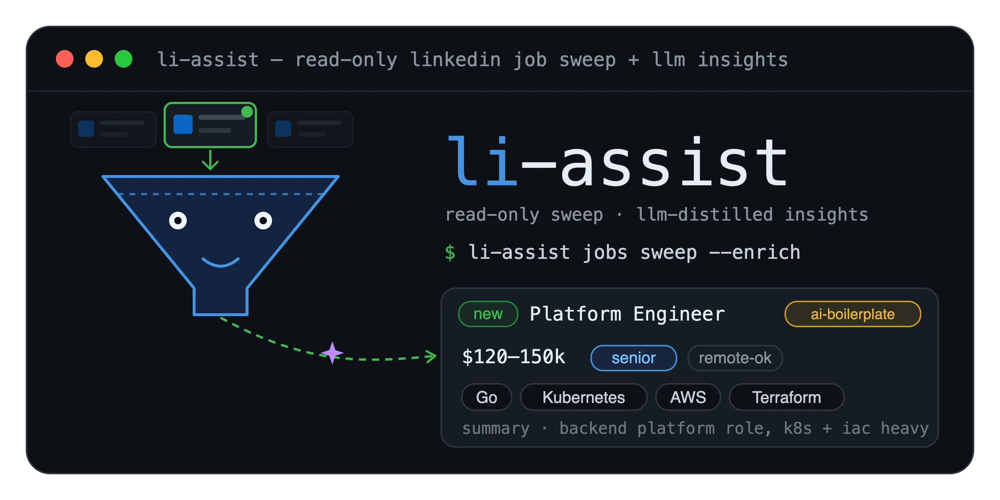

# li-assist



A personal, **read-only** LinkedIn command-line tool for job hunting and research. It searches and reads jobs through LinkedIn's own `voyager` API by driving a real signed-in Chromium session, caches what it sees locally, and can distill noisy job descriptions into structured insights using a local or hosted LLM.

> Single-user tool. It does **not** post, comment, message, connect, or perform any write action. Formerly named `om-li`.

---

## At a glance

| | |
|---|---|
| **Language** | Go (single static binary, `CGO_ENABLED=0`) |
| **Binary / command** | `li-assist` |
| **Module path** | `github.com/kevin-burns/linkedin-assist` |
| **Transport** | Real Chromium via `chromedp`; voyager calls run as in-page `fetch()` (no cookie/header replay) |
| **State** | Everything under `~/.config/li-assist/` (disposable) |
| **Scope** | Read-only: jobs search, job detail, daily sweep/diff, warm intros, optional LLM enrichment |
| **Agent skill** | `skill/SKILL.md` — drive it from Claude Code / Codex (read-only, rate-limit-aware) |

### Dominant constraints (read before changing anything)

1. **Account safety is paramount.** A LinkedIn account ban is the worst outcome. Every voyager call goes through a jittered rate limiter with a daily cap. Never add an unbounded or parallel burst of voyager calls.
2. **Read-only by design (v0).** No write/engagement actions exist or should be added without an explicit decision.
3. **Never commit live session data.** The Chrome profile holds a live `li_at` cookie. Capture files (`*.curl`, `raw-*.txt`, `*.spike`, `_capture/`) are gitignored; `gitleaks` is the backstop.

---

## Install

> **Requirements:** a local Google Chrome / Chromium is needed at runtime (for the signed-in browser session). Building from source additionally needs Go (see `go.mod`).

`li-assist` is a single static binary (`CGO_ENABLED=0`, `-s -w`, ~9 MB). Four ways to install it:

| Method | Status | macOS quarantine step? |
|---|---|---|
| `go install` | ✅ Available | No — built on your machine |
| Pre-built release binary | ✅ Available — see [Releases](https://github.com/kevin-burns/linkedin-assist/releases) | Yes — clear it by hand (below) |
| Build from source | ✅ Available | No — a binary you compile locally is never quarantined |
| Homebrew tap | ⏳ Planned | No — Homebrew clears it for you |

With Go installed, this is the quickest:

```sh
go install github.com/kevin-burns/linkedin-assist/cmd/li-assist@latest
li-assist --version
```

### Build from source (available now)

```sh
git clone <repo-url> linkedin-assist && cd linkedin-assist
go build -o li-assist ./cmd/li-assist
./li-assist --version
mv li-assist ~/.local/bin/        # or any dir on your $PATH
```

No macOS `xattr`/`codesign` dance — a locally compiled binary never receives the `com.apple.quarantine` attribute.

### Pre-built binaries

Every release attaches one `tar.gz` per platform — **macOS and Linux, `amd64` + `arm64`** (no Windows) — plus a `checksums.txt`. Grab the archive for your platform from the [Releases](https://github.com/kevin-burns/linkedin-assist/releases) page, verify its SHA256 against `checksums.txt`, extract, and move `li-assist` onto your `$PATH`:

```sh
# pick the asset matching your OS/arch (example: Apple Silicon)
curl -LO https://github.com/kevin-burns/linkedin-assist/releases/download/v0.1.0/li-assist_0.1.0_darwin_arm64.tar.gz
tar -xzf li-assist_0.1.0_darwin_arm64.tar.gz
mv li-assist ~/.local/bin/ && chmod +x ~/.local/bin/li-assist
```

The binaries are built with [GoReleaser](https://goreleaser.com) (`-trimpath`, stripped).

#### macOS: clear the download quarantine

`curl` and browsers set the `com.apple.quarantine` extended attribute on downloaded files, so macOS refuses to run them (*"li-assist" cannot be opened because the developer cannot be verified*). After downloading a release binary — **skip this entirely if you built from source** — clear it:

```sh
xattr -d com.apple.quarantine ~/.local/bin/li-assist   # 1. strip the quarantine attr
codesign --force --sign - ~/.local/bin/li-assist       # 2. ad-hoc local signature
li-assist --version                                     # 3. verify
```

If `xattr -d` reports *No such xattr*, the file wasn't quarantined — just run `li-assist --version`. (Once releases are notarized, this step goes away.)

### Homebrew (planned)

Once the tap publishes:

```sh
brew install <owner>/tap/li-assist
```

Homebrew-installed binaries are not quarantined, so there is **no** `xattr`/`codesign` step — this is the lowest-friction path on macOS and the eventual default.

---

## Commands

### Before you start

**Chrome or Chromium is a runtime requirement.** `li-assist` is not a headless scraper — it drives a real signed-in browser session so LinkedIn sees the same requests your browser sends. Install [Google Chrome](https://www.google.com/chrome/) (or a Chromium package) before running any command.

**`auth login` opens a real browser window.** When you run `li-assist auth login`, a visible Chrome window appears and navigates to the LinkedIn login page. Sign in as you normally would.

- **2FA is normal and expected.** If LinkedIn asks for a verification code or shows a security challenge, complete it in the window — this is not a tool error.
- **Tick "Keep me logged in."** LinkedIn sometimes issues session-only cookies when this box is unchecked; those cookies are discarded when Chrome closes and the next command reports "not logged in". Ticking the box makes the session cookie persistent.
- **This drives your real LinkedIn account.** The session is live and authenticated. `li-assist` is read-only by design and goes through the same rate limiter as your browser, but treat it as you would any signed-in client — don't run it against accounts you don't own.

After a successful login the session is stored in `~/.config/li-assist/chrome/`. All subsequent commands (headless) reuse that profile without opening a visible window.

```sh
li-assist auth login                 # open Chrome, sign in to LinkedIn (interactive, one time)
li-assist auth status                # session age + 14-day staleness verdict (no browser launched)
li-assist doctor [--check-login-flow]# health checks: credentials, staleness, one rate-limited voyager probe
li-assist config location            # print home location default
li-assist config location "Aachen, Germany"  # set home location default
li-assist config location --clear    # clear home location default
li-assist config connections <path>  # point at your Connections.csv export (enables --intros)
li-assist jobs search <keyword...>   # search jobs (multi-word; LinkedIn boolean operators supported)
li-assist jobs get <urn>             # fetch one job's full detail
li-assist jobs sweep <keyword...>    # search, diff against the local cache, report only what's new
```

Multiple positional words are joined into a single keyword string:

```sh
li-assist jobs search senior platform engineer        # → keyword "senior platform engineer"
li-assist jobs sweep "senior platform engineer"       # identical to the above
li-assist jobs search '"platform engineer" OR devops NOT recruiter'  # LinkedIn boolean operators
```

### Flags per command

| Command | Flag | Default | Meaning |
|---|---|---|---|
| `config location` | `[value]` | — | Set home location (e.g. `"Aachen, Germany"`); omit value to print current |
| | `--clear` | — | Clear the home location |
| `config connections` | `[path]` | — | Set the `Connections.csv` path for `--intros`; omit to print; `--clear` to clear |
| `jobs search <keyword...>` | `--location <str>` | home_location | Location filter; overrides the home location set via `config location` |
| | `--anywhere` | false | Search worldwide (no location filter); mutually exclusive with `--location` |
| | `--limit <n>` | `25` | Max results |
| | `--exclude-company <name>` (repeatable) | — | Hide a company (case-insensitive substring); also reads `excluded-companies.txt` |
| | `--exclude-title <term>` (repeatable) | — | Drop results whose title contains this term (case-insensitive substring); for server-side exclusion the LinkedIn `NOT` operator in the keyword also works |
| | `--format json\|okf` | `json` | Output format (`okf` is stubbed — returns an error until the Ogham bundle format is defined) |
| `jobs get <urn>` | `--refresh` | false | Bypass the cache and re-fetch from voyager |
| | `--enrich` | false | Run LLM enrichment on the job (see [Enrichment](#enrichment)) |
| | `--intros` | false | List 1st-degree connections at the job's company (see [Warm intros](#warm-intros-offline)) |
| | `--connections <path>` | — | Path to your `Connections.csv` export (overrides env + config) |
| | `--format json\|okf` | `json` | Output format |
| `jobs sweep <keyword...>` | `--location`, `--anywhere`, `--limit`, `--exclude-company`, `--exclude-title` | — | Same as `jobs search` (`--limit` default `25`) |
| | `--all` | false | Print all results, not just new-since-last-sweep |
| | `--enrich` | false | Enrich NEW jobs (bounded — see [Enrichment](#enrichment)) |
| | `--intros` `--connections <path>` | — | Annotate each new job with known connections (see [Warm intros](#warm-intros-offline)) |
| | `--format json` | `json` | `sweep` supports **`json` only** (`okf` returns an error; only `search`/`get` accept `okf`) |
| `auth status` | `--json` | false | Emit status as JSON (for scripting) |
| `doctor` | `--check-login-flow` | false | Open a visible Chrome window to verify the LinkedIn login page renders (catches Chrome/network breakage); reuses the open session |

A `<urn>` is a LinkedIn job URN, e.g. `urn:li:fsd_jobPosting:4313223964`.

### Location

`jobs search` and `jobs sweep` apply location in this precedence order:

1. `--anywhere` — worldwide search (no location filter); mutually exclusive with `--location`.
2. `--location <str>` — use the given location string for this run.
3. *(default)* — fall back to `home_location` from `~/.config/li-assist/config.json` (set via `li-assist config location`).

Set a home location once so you never need to type `--location` again:

```sh
li-assist config location "Aachen, Germany"   # set it
li-assist config location                      # print it
li-assist config location --clear              # clear it
```

### The sweep / diff model

`jobs sweep` is the core workflow: it searches, classifies each result as **NEW** or **SEEN** against the local cache, prints only the new ones, and **always** writes an audit line to stderr — never silently. Example:

```
sweep: 30 new / 12 seen / 2 excluded (cache: 44 jobs) | enriched 20/30 new (cap 25), 3 error(s), 7 skipped (raise LI_ASSIST_ENRICH_MAX_PER_RUN)
```

The cache is a self-evicting JSONL file (`jq`-able, disposable). A repost gets a new job id, so it correctly shows up as new.

### Warm intros (offline)

`--intros` (on `jobs get` and `jobs sweep`) cross-references your own LinkedIn connections against each job's employer and lists who you already know there. It runs **entirely offline** from your **Connections.csv** export: zero extra network calls, and it never messages anyone.

Get the export once on LinkedIn under **Settings → Data Privacy → Get a copy of your data → Connections**. Then either drop `Connections.csv` at `~/.config/li-assist/connections.csv`, or remember its path:

```sh
li-assist config connections ~/Downloads/Connections.csv          # remember it
li-assist jobs sweep "platform engineer" --intros                 # new jobs, annotated with people you know there
li-assist jobs get <urn> --intros --connections ./Connections.csv # or pass a one-off path
```

Each match shows the connection's name, profile URL, current title, and the date you connected. The file holds real people's names, so `Connections.csv` is gitignored and the email column is dropped on import. Path precedence: `--connections` > `LI_ASSIST_CONNECTIONS_CSV` > `config connections` > `~/.config/li-assist/connections.csv`.

A connection counts when their current employer matches the job's company (after light normalization). Fuzzy matching and ranking are deferred for now.

---

## Enrichment

`--enrich` turns a marketing-heavy job description into structured `Insights` (real summary, top required skills, salary range, seniority, condensed description, and notes flagging AI-generated boilerplate). Enrichment calls an LLM only — it never touches LinkedIn, so it carries **no account-ban risk** (only API cost / local compute).

- `jobs get <urn> --enrich` enriches that one job.
- `jobs sweep <kw> --enrich` enriches NEW jobs: for each, it detail-fetches (rate-limited, cache-first) then enriches, **bounded by `LI_ASSIST_ENRICH_MAX_PER_RUN` (default 25)**. The cap and any errors/skips are reported in the audit line.

Insights are cached (`insights` field in the job cache) and computed **once** per job — a second run reuses them.

### Providers

The provider is auto-detected in this order, or forced with `LI_ASSIST_ENRICH_PROVIDER`:

1. **Ollama** — if reachable (or auto-startable; see below)
2. **OpenAI** — if `OPENAI_API_KEY` is set
3. **Gemini** — if `GEMINI_API_KEY` is set
4. **Anthropic** — if `ANTHROPIC_API_KEY` is set
5. else enrichment is skipped gracefully (a one-line stderr note; the command still returns the job)

Ollama/OpenAI/Gemini are reached over the OpenAI-compatible `chat/completions` API; Anthropic uses its native `/v1/messages` API. Chat models only (no extended-thinking modes).

**Ollama auto-start:** when Ollama is the chosen provider and the server is down, `li-assist` starts `ollama serve` for you and waits for it to be ready. Disable with `LI_ASSIST_OLLAMA_AUTOSTART=false`. (Auto-detect mode never starts a daemon as a side effect — only the explicitly forced `ollama` provider does.)

### Default models

Set `LI_ASSIST_ENRICH_MODEL` to use any chat model your provider offers. Defaults (current as of 2026-06; model IDs drift, so the override is the safety net):

| Provider | Default model | Notes |
|---|---|---|
| ollama | `llama3.2` | Must be pulled locally (`ollama pull <model>`). On a 16 GB machine, prefer a ~4B model so it coexists with the Chrome session. |
| openai | `gpt-5.4-mini` | |
| gemini | `gemini-2.5-flash` | |
| anthropic | `claude-haiku-4-5` | |

### Switching provider / model

`LI_ASSIST_ENRICH_PROVIDER` selects the provider; the matching key is read from the environment; `LI_ASSIST_ENRICH_MODEL` (optional) overrides the model. All four are validated working.

```sh
# Local (default): Ollama — uses LI_ASSIST_ENRICH_MODEL, e.g. a model you've `ollama pull`ed
export LI_ASSIST_ENRICH_PROVIDER=ollama
export LI_ASSIST_ENRICH_MODEL=qwen3.5:4b-mlx     # ~4B fits a 16 GB machine alongside Chrome

# OpenAI    — needs OPENAI_API_KEY     (default model gpt-5.4-mini)
export LI_ASSIST_ENRICH_PROVIDER=openai

# Gemini    — needs GEMINI_API_KEY     (default model gemini-2.5-flash)
export LI_ASSIST_ENRICH_PROVIDER=gemini

# Anthropic — needs ANTHROPIC_API_KEY  (default model claude-haiku-4-5)
export LI_ASSIST_ENRICH_PROVIDER=anthropic

# Override the model for whichever provider is active:
export LI_ASSIST_ENRICH_MODEL=<provider-chat-model-id>
# ...then unset it (or set it to an Ollama model) when switching back to Ollama.
```

> Heads-up: `LI_ASSIST_ENRICH_MODEL` is provider-specific. If you set it to an Ollama model name (e.g. `qwen3.5:4b-mlx`) and then switch `LI_ASSIST_ENRICH_PROVIDER` to `openai`/`gemini`/`anthropic` **without** clearing it, the API call will fail (unknown model). Unset it to fall back to the provider default.

---

## Configuration

All state lives under `~/.config/li-assist/`:

| Path | Purpose |
|------|---------|
| `chrome/` | Persistent Chrome profile (holds the live login) |
| `credentials.json` | Login metadata (captured-at, li_at expiry) — `0600` |
| `config.json` | Persistent settings (`home_location`, `connections_path`, …) — `0600`; managed via `li-assist config` |
| `usage.json` | Daily rate-limit counter |
| `cache/jobs.jsonl` | Local job cache (capped, self-evicting) |
| `excluded-companies.txt` | Persistent company exclusion list (one per line) |
| `connections.csv` | Your LinkedIn Connections.csv export for `--intros` (optional; gitignored) |

### Environment variables

| Variable | Default | Description |
|----------|---------|-------------|
| `LI_ASSIST_MIN_GAP_MS` | `3000` | Minimum gap between voyager calls (ms) |
| `LI_ASSIST_MAX_GAP_MS` | `6000` | Maximum gap between voyager calls (ms) |
| `LI_ASSIST_DAILY_CAP` | `100` | Max voyager calls per calendar day (fail-fast when exceeded) |
| `LI_ASSIST_REAUTH_DAYS` | `14` | Session is treated as stale after this many days |
| `LI_ASSIST_CACHE_MAX_BYTES` | `10485760` | Job cache size cap (10 MB; LRU eviction by oldest last-seen) |
| `LI_ASSIST_ENRICH_PROVIDER` | (auto) | Force `ollama` \| `openai` \| `gemini` \| `anthropic` \| `none` |
| `LI_ASSIST_ENRICH_MODEL` | per-provider | Override the chat model |
| `LI_ASSIST_ENRICH_MAX_PER_RUN` | `25` | Max NEW jobs enriched per `sweep --enrich` (≤0 clamps to default) |
| `LI_ASSIST_CONNECTIONS_CSV` | — | Path to your Connections.csv export for `--intros` |
| `LI_ASSIST_OLLAMA_HOST` | `http://localhost:11434` | Ollama base URL |
| `LI_ASSIST_OLLAMA_AUTOSTART` | `true` | Auto-start `ollama serve` when provider is `ollama` and it's down |
| `LI_ASSIST_OLLAMA_START_TIMEOUT` | `15s` | How long to wait for Ollama to become ready |
| `OPENAI_API_KEY` / `GEMINI_API_KEY` / `ANTHROPIC_API_KEY` | — | Provider keys (read from the environment; never logged) |

---

## Repo map (for navigation)

5-layer Clean Architecture. The dependency direction is **CI-enforced** (`make check-deps`): inner layers never import outer ones.

```
cmd/li-assist/        Cobra commands + composition root (wires sessions, transport, usecases)
  main.go  auth.go  jobs.go  doctor.go  exclude.go  config.go  location.go  intros.go

internal/
  domain/             Pure value objects, zero deps: urn, job, company, person, insights, errors
  usecase/            Application logic + ports (interfaces): SearchJobs, GetJob, SweepJobs,
                      EnrichJob, EnrichNewJobs; ports.go (JobsRepo, JobGetter, JobCache, Enricher)
  auth/               Persistent chromedp Session, credential store, staleness, auth status
  voyager/            voyager HTTP transport (fetch-in-page) + parsers (jobs search, job detail)
  enrich/             Provider-agnostic LLM client (OpenAI-compat + Anthropic) + ollama autostart
  cache/              Capped JSONL job cache (+ insights persistence)
  ratelimit/          Jittered cadence + daily cap
  output/             JSON encoders (default; `okf` stubbed)
  connections/        Offline Connections.csv loader for `--intros` (imports only domain)

skill/                Agent skill (SKILL.md) so Claude/Codex can drive li-assist (read-only)
```

Dependency rule of thumb: `domain` imports nothing internal; `usecase` imports only `domain`; `cache`/`output`/`enrich` import only `domain`; `voyager`/`auth`/`cmd` may import inward. If you add a package, add its rule to `make check-deps`.

### How voyager access works

`li-assist` does not replay cookies. It opens a persistent Chromium profile, navigates to a `linkedin.com` page (required so the request is same-origin), then evaluates `fetch('/voyager/api/...')` in the page so the browser attaches the session automatically. The CSRF token is the `JSESSIONID` cookie with surrounding quotes stripped. Parsers are pinned against committed, PII-clean replay corpora under `internal/voyager/testdata/`.

---

## What li-assist does — and deliberately does not — do

There are two different kinds of "no" here, and the distinction matters:

- **Never, by design.** `li-assist` is **read-only**. It will never post, comment, react, message, connect, follow, or apply — there is no write path in the code and adding one is an explicit non-goal. This is the safety contract, not a missing feature. The whole point of a single-user, rate-limited, read-only tool is that it can't get your account into trouble by *acting*.
- **Deferred (out of reach right now).** Some *read* surfaces LinkedIn moved behind Server-Driven UI (SDUI) or server-rendered HTML, so there is no clean `voyager` endpoint left to parse. These aren't refusals — they could return if a clean path appears.

| Capability | Status |
|---|---|
| `jobs search`, `jobs get`, `jobs sweep` (multi-term + boolean keywords) | ✅ Working, live-verified |
| Default home location, `--location`, `--anywhere` | ✅ Working |
| Company / title exclusions (`--exclude-company`, `--exclude-title`) | ✅ Working |
| LLM enrichment (`--enrich`) | ✅ Working |
| Warm intros from your Connections.csv (`--intros`) | ✅ Working — offline, exact-company match (fuzzy/ranking deferred) |
| `auth login/status`, `doctor`, `config location`, `config connections` | ✅ Working |
| Company `get` / `employees` | 🚧 Deferred — still clean voyager; capture corpora exist, deprioritized |
| Company **search**, People **search**, Person profile | ⛔ Deferred — migrated to Server-Driven UI (`flagship-web/rsc-action`, `com.linkedin.sdui.*`); no clean voyager endpoint |
| Read a **post / article body** | ⛔ Deferred — bodies are server-rendered into the page HTML; the clean `voyagerFeedDashUpdates` XHR does not fire reliably. Only the social layer (reactions/comments) is clean voyager. Would need DOM extraction. |
| Job search by **distance/radius** | ⛔ Deferred — LinkedIn removed distance from the clean jobs endpoint; it now lives only in the SDUI/AI search |
| Browse the **feed** / **search posts** | ⛔ Deferred — SDUI-walled (`com.linkedin.sdui.pagers.feed.mainFeed` / `…search.contentSearchResults`) |
| Posting, commenting, reacting, messaging, connecting, applying | ❌ **Never — read-only by design** |

---

## Agent skill (drive li-assist from Claude / Codex)

`skill/SKILL.md` is a bundled **agent skill** that teaches a coding assistant (Claude Code, Codex, or any skill-aware agent) how to drive `li-assist` correctly: the verbs and flags, the JSON output shapes, the enrichment environment variables, and — most importantly — the account-safety boundary (read-only only, never bypass the rate limiter, and the SDUI/deferred surfaces it must not attempt). With it loaded, the agent constructs the right commands from plain requests like *"track new platform-engineer roles near me"* and **refuses** out-of-scope asks (posting, messaging, people search) by design.

It does **not** bundle the binary: the skill resolves `li-assist` on your `$PATH` and otherwise points at build-from-source — the same pattern as the [`c7search`](https://github.com/kevin-burns/c7search) skill — so it stays small and platform-agnostic.

To install it for Claude Code:

```sh
cp -r skill ~/.claude/skills/li-assist
```

The agent then loads it on demand whenever you ask it to search, track, or inspect LinkedIn jobs.

---

## Development

### One-time setup

```sh
pre-commit install
```

Installs git hooks that run on every commit: `gofmt` / `go vet` / `go build`, `golangci-lint` (gosec, errcheck, govet, staticcheck), and `detect-private-key` + `gitleaks` (the backstop against committing live session tokens or cURL captures).

### Daily workflow

```sh
make check         # dependency-direction gate + lint + tests (fast feedback)
make test-race     # tests with the race detector (run before merging)
make security-scan # gosec (SAST) + govulncheck (CVE database)
make ship-check    # full pre-release gate: check + security-scan + deps-check
```

### Conventions for contributors and coding agents

- **Test-first.** Parsers are tested against committed replay corpora; the enrichment client is tested against a mock HTTP server (no live calls in unit tests).
- **Respect the dependency gate.** Run `make check-deps` before proposing a change; new packages need a rule.
- **Never bypass the rate limiter** for voyager calls; never add parallel voyager bursts.
- **No live data in git.** Never commit anything from `~/.config/li-assist/` or a capture file.
- Commit messages and any public text carry no AI-assistant attribution.

---

## Migrating from `om-li`

If you used the tool under its old name, move your config so the existing login carries over:

```sh
mv ~/.config/om-li ~/.config/li-assist
```

---

## Prior art

The browser-resident transport and several voyager facts (the `{data, included[]}` envelope, CSRF derivation, the profile endpoint) were informed by [`eracle/linkedin-cli`](https://github.com/eracle/linkedin-cli) (MIT). The jobs-search and job-detail endpoint shapes were captured independently.

---

## Contributing

Contributions are welcome — see [CONTRIBUTING.md](CONTRIBUTING.md). The short version: the tool is **read-only by charter** and account safety comes first, so please read the guardrails before adding features. Security reports: see [SECURITY.md](SECURITY.md).

## License

[MIT](LICENSE) © 2026 Kevin Burns.
